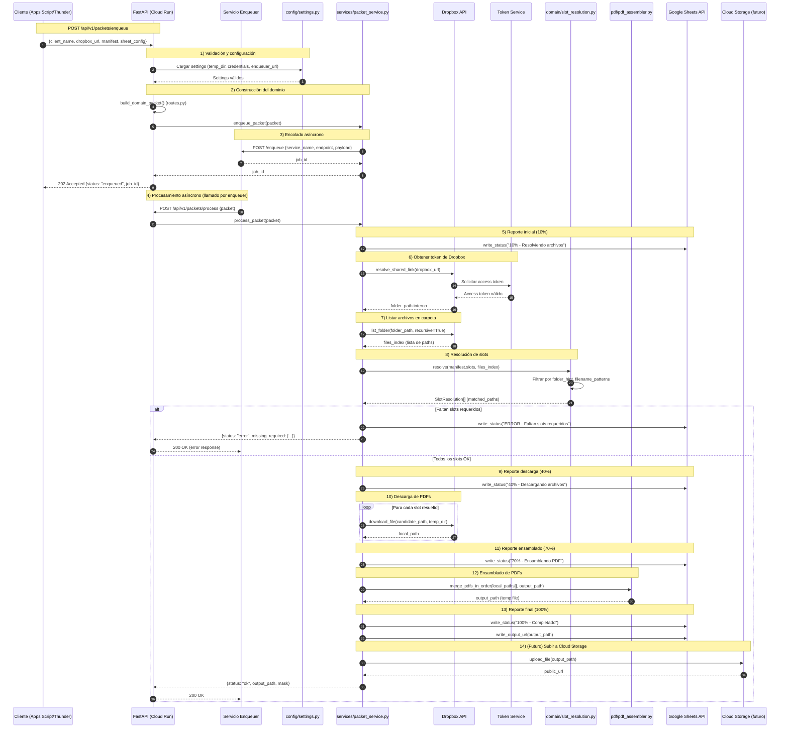
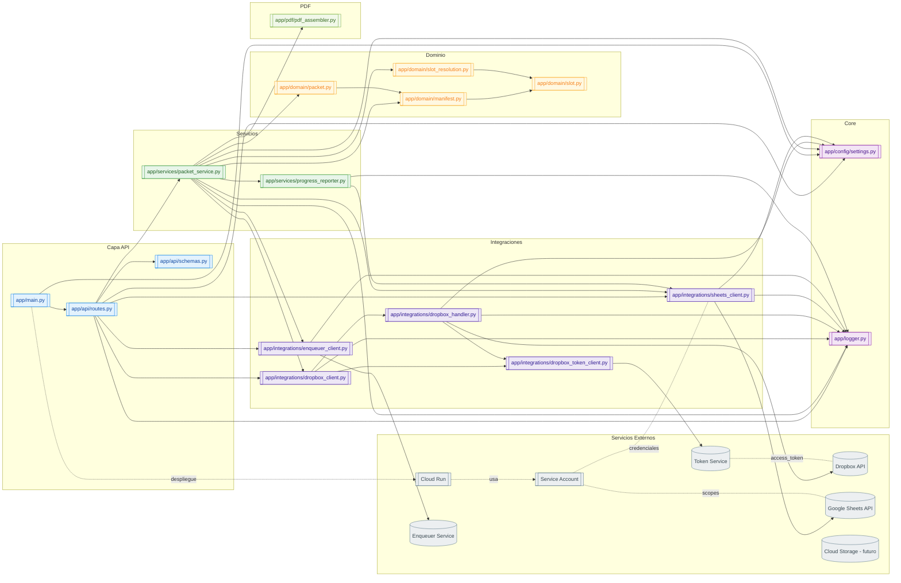

# PDF Packet Service

Microservicio en Python 3.11 + FastAPI para ensamblar un PDF final a partir de múltiples PDFs obtenidos de Dropbox, con reporte de progreso en Google Sheets y desplegable en Google Cloud Run.

## 📋 Características

- ✅ **Ensamblado de PDFs**: Combina múltiples PDFs en orden usando `pypdf`
- ✅ **Sistema de Slots**: Manifest flexible para definir qué documentos incluir
- ✅ **Resolución inteligente**: Mapea archivos de Dropbox a slots usando folder hints y patrones
- ✅ **Integración Dropbox**: Descarga automática desde carpetas compartidas
- ✅ **Reporte en Google Sheets**: Actualizaciones de progreso en tiempo real
- ✅ **Arquitectura por capas**: Domain, Services, Integrations, API
- ✅ **Enqueuer integration**: Soporte para jobs de larga duración

## 🏗️ Arquitectura

```
app/
├── domain/          # Modelos puros y reglas de negocio
│   ├── slot.py           # Definición de Slot y SlotMeta
│   ├── manifest.py       # Manifest con validación y máscaras
│   ├── packet.py         # Packet, SheetOutputConfig, SheetPosition
│   └── slot_resolution.py # SlotResolver con lógica de mapeo
├── services/        # Orquestación y lógica de aplicación
│   ├── packet_service.py    # Servicio principal
│   └── progress_reporter.py # Reporte de progreso
├── integrations/    # Integraciones externas
│   ├── dropbox_handler.py      # Operaciones de Dropbox API
│   ├── dropbox_client.py       # Cliente de alto nivel
│   ├── dropbox_token_client.py # Cliente de tokens
│   ├── sheets_client.py        # Cliente de Google Sheets API v4
│   └── enqueuer_client.py      # Cliente del servicio enqueuer
├── pdf/             # Capa de ensamblado de PDFs
│   └── pdf_assembler.py # merge_pdfs_in_order()
├── api/             # FastAPI routers y schemas
│   ├── routes.py    # Endpoints /enqueue y /process
│   └── schemas.py   # Pydantic models
├── config/          # Configuración
│   └── settings.py  # Settings con pydantic-settings
└── logger.py        # Logging configurado
```

### 1) Vista general (flujo funcional)



### 2) Vista técnica (módulos y dependencias)



## 🚀 Endpoints

### `POST /api/v1/packets/enqueue`

Encola un paquete para procesamiento asíncrono (respuesta inmediata).

**Request:**
```json
{
  "client_name": "Jane Doe",
  "dropbox_url": "https://www.dropbox.com/scl/fo/...",
  "sheet_output_config": {
    "spreadsheet_id": "1abc...",
    "sheet_name": "VAWA"
  },
  "sheet_position": {
    "row": 12,
    "col_output": 5,
    "col_status": 6
  },
  "manifest": [
    {
      "slot": 1,
      "name": "Exhibit A – Cover",
      "required": true,
      "folder_hint": "EXHIBIT 1",
      "filename_patterns": ["cover*.pdf", "petition.pdf"],
      "tags": ["important"]
    }
  ]
}
```

**Response (202 Accepted):**
```json
{
  "status": "enqueued",
  "message": "Job enqueued successfully for client Jane Doe",
  "job_id": "job-abc123"
}
```

### `POST /api/v1/packets/process`

Procesa un paquete de forma síncrona (usado por el enqueuer).

**Response (200 OK):**
```json
{
  "status": "completed",
  "message": "Processed packet for Jane Doe. Output: /tmp/packet_Jane_Doe.pdf",
  "job_id": null
}
```

## ⚙️ Configuración

### Variables de entorno (.env)

```bash
# Service name
PACKET_APP_NAME=pdf-packet-service

# Dropbox integration
PACKET_DROPBOX_TOKEN_SERVICE_URL=https://accesstokendropbox-xxx.run.app/api/v1/token
PACKET_DROPBOX_SERVICE_SIGNATURE=930xY0dJ0pD

# Google Sheets integration
PACKET_GOOGLE_CREDENTIALS_PATH=/path/to/service-account.json

# GCP configuration
PACKET_GCP_PROJECT_ID=my-project-id

# Storage
PACKET_TEMP_DIR=/tmp

# Enqueuer integration (opcional)
PACKET_ENQUEUER_SERVICE_URL=https://enqueuer-xxx.run.app
```

### Service Account de Google

1. Crear service account en GCP Console
2. Habilitar Google Sheets API
3. Descargar JSON de credenciales
4. Compartir las Sheets con el email del service account

## 📦 Instalación

### Local

```bash
# Crear entorno virtual
python -m venv venv
source venv/bin/activate  # En Windows: venv\Scripts\activate

# Instalar dependencias
pip install -r requirements.txt

# Configurar variables de entorno
cp .env.example .env
# Editar .env con tus credenciales

# Ejecutar servidor
uvicorn app.main:app --reload --host 0.0.0.0 --port 8000

# Abrir documentación interactiva
# http://localhost:8000/docs
```

### Docker

```bash
# Build
docker build -t pdf-packet-service .

# Run
docker run --env-file .env -p 8000:8000 pdf-packet-service
```

## ☁️ Despliegue en Cloud Run

### Con gcloud CLI

```bash
# Configurar proyecto
export PROJECT_ID=my-project-id
gcloud config set project $PROJECT_ID

# Build imagen
gcloud builds submit --tag gcr.io/$PROJECT_ID/pdf-packet-service

# Deploy a Cloud Run
gcloud run deploy pdf-packet-service \
  --image gcr.io/$PROJECT_ID/pdf-packet-service \
  --platform managed \
  --region us-central1 \
  --allow-unauthenticated \
  --timeout 3600 \
  --memory 2Gi \
  --set-env-vars PACKET_DROPBOX_TOKEN_SERVICE_URL=https://... \
  --set-env-vars PACKET_DROPBOX_SERVICE_SIGNATURE=930xY0dJ0pD \
  --set-env-vars PACKET_GOOGLE_CREDENTIALS_PATH=/secrets/credentials.json

# IMPORTANTE: Montar secret con service account credentials
gcloud run services update pdf-packet-service \
  --update-secrets /secrets/credentials.json=google-credentials:latest
```

## 🔧 Sistema de Slots

### ¿Qué es un Slot?

Un **slot** representa un documento esperado en el PDF final:

```python
{
  "slot": 1,              # Posición en el PDF (1, 2, 3, ...)
  "name": "Cover Page",   # Nombre descriptivo
  "required": true,       # ¿Es obligatorio?
  "folder_hint": "EXHIBIT 1",  # Carpeta donde buscar
  "filename_patterns": ["cover*.pdf", "petition.pdf"],  # Patrones
  "tags": ["important"]   # Etiquetas libres
}
```

### Lógica de Resolución

El `SlotResolver` mapea slots a archivos reales:

1. **Filtro por carpeta**: Si `folder_hint` está presente, busca en carpetas que contengan ese texto
2. **Filtro por patrones**: Si `filename_patterns` está presente, aplica wildcards o regex
3. **Filtro por extensión**: Solo archivos `.pdf`
4. **Selección**: Toma el primer candidato encontrado

**Ejemplo:**

```
Dropbox structure:
  /EXHIBIT 1/
    cover.pdf         ← Match!
    petition.pdf
  /EXHIBIT 2/
    abuse_doc.pdf

Slot:
  slot=1, folder_hint="EXHIBIT 1", patterns=["cover*.pdf"]

Resolution:
  ✅ Match: /EXHIBIT 1/cover.pdf
```

### Patrones soportados

- **Literal**: `"petition.pdf"` → busca "petition" en el nombre
- **Wildcard**: `"petition*.pdf"` → petition_v1.pdf, petition_final.pdf
- **Regex**: `"regex:petition_[0-9]+\\.pdf"` → petition_1.pdf, petition_2.pdf

## 🔄 Flujo de Integración con Enqueuer

```
┌─────────────┐      ┌─────────────┐      ┌──────────────────┐
│ Apps Script │ ───> │  Enqueuer   │ ───> │  PDF Packet Svc  │
└─────────────┘      └─────────────┘      └──────────────────┘
       │                    │                       │
       │ POST /enqueue      │ POST /process         │
       │                    │                       │
       └──── job_id ────────┘                       │
                                                     │
                           ┌─────────────────────────┘
                           │
                           ▼
                    ┌──────────────┐      ┌────────────────┐
                    │   Dropbox    │◄─────┤ Google Sheets  │
                    │ (Descargas)  │      │  (Progreso)    │
                    └──────────────┘      └────────────────┘
```

### Ejemplo de progreso reportado

Durante `process_packet()`, el servicio actualiza la celda de status:

```
10% - Resolviendo archivos
40% - Descargando archivos
70% - Ensamblando PDF
100% - Completado
```

## 📝 Ejemplo de Manifest VAWA

```json
{
  "manifest": [
    {
      "slot": 1,
      "name": "Exhibit A – Cover",
      "required": true,
      "folder_hint": "EXHIBIT 1",
      "filename_patterns": ["cover.pdf"]
    },
    {
      "slot": 2,
      "name": "Exhibit A – Petition",
      "required": true,
      "folder_hint": "EXHIBIT 1",
      "filename_patterns": ["petition*.pdf"]
    },
    {
      "slot": 3,
      "name": "Exhibit B – Evidence",
      "required": false,
      "folder_hint": "EXHIBIT 2"
    },
    {
      "slot": 4,
      "name": "Exhibit C – Police Report",
      "required": true,
      "folder_hint": "EXHIBIT 3",
      "filename_patterns": ["police*.pdf", "rap_sheet.pdf"]
    },
    {
      "slot": 5,
      "name": "Exhibit D – GMC Records",
      "required": true,
      "folder_hint": "EXHIBIT 4/GMC"
    }
  ]
}
```

## 🐛 Troubleshooting

### Error: "DropboxHandler not available"
- Verificar que `PACKET_DROPBOX_TOKEN_SERVICE_URL` esté configurado
- Verificar que el servicio `accesstokendropbox` esté corriendo
- Verificar la firma `PACKET_DROPBOX_SERVICE_SIGNATURE`

### Error: "SheetsClient service not initialized"
- Verificar que `PACKET_GOOGLE_CREDENTIALS_PATH` apunte al JSON válido
- Verificar que el service account tenga permisos en la Sheet
- Habilitar Google Sheets API en GCP Console

### Error: "Failed to resolve Dropbox shared link"
- Verificar que la URL sea un link compartido válido (`/scl/fo/...`)
- Para cuentas de equipo, asegurar que el token tenga acceso al namespace correcto

### PDFs corruptos
- El servicio usa `pypdf` con `strict=False` para PDFs problemáticos
- Si persiste, considerar migrar a `pikepdf` (requiere cambios en `pdf_assembler.py`)

## 📚 Estado del proyecto

### ✅ Completado

- Arquitectura por capas limpia
- Integración completa con Dropbox (handler + token service)
- SlotResolver funcional con folder hints y patrones
- Google Sheets client con API v4
- ProgressReporter integrado en el flujo
- Cliente HTTP para servicio enqueuer
- Manejo robusto de errores en endpoints
- Documentación completa

### 🚧 Próximos pasos

- [ ] Subir PDF final a Google Cloud Storage o Google Drive
- [ ] Implementar retry logic para descargas fallidas
- [ ] Agregar telemetría (Cloud Logging, Cloud Trace)
- [ ] Tests unitarios y de integración
- [ ] Documentación de manifiestos por tipo de caso (VAWA, asylum, etc.)
- [ ] Soporte para otros proveedores de storage (Google Drive, AWS S3)

## 📄 Licencia

Este proyecto es privado y de uso interno.
